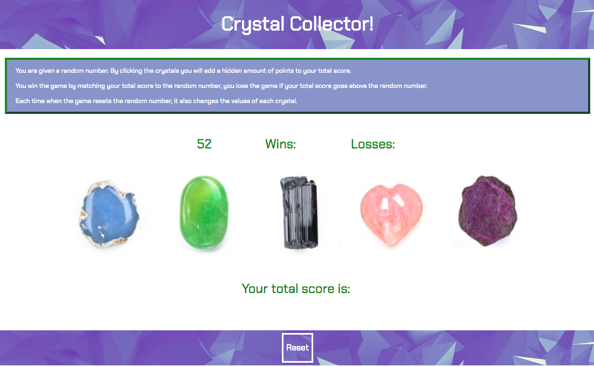

# Crystal Collector
Game: Cristal Collector \
Created for: Northwestern Coding Bootcamp \
Developer: Natalia Kukula \
Deployment Date:  September 26, 2018 \
Published: GitHub <https://nataliakukula.github.io/unit-4-game/> \
Built with: HTML5, CSS3, Media Query, Javascript & jQuery

## Summary: 

* The user is given a random number.

* By clicking the crystals the user will add a specific amount of points to the total score.

* The values of the crystals are hidden and get summed up in the total score.

* The game is won by matching the total score to the random number and lost if the total score goes above the random number.

* Each time when the game resets the random number, it also changes the values of each crystal.

* The game can be reset by clicking the reset button.

## Notes:
There's probably a easier way to write this code... 🙈

Nevertheless, I am proud of myself for getting it done in 48 hours as someone that's been coding for 4 weeks. 💪🏼

This northwestern coding bootcamp homework has been challenging, but has proven to me what I can do.